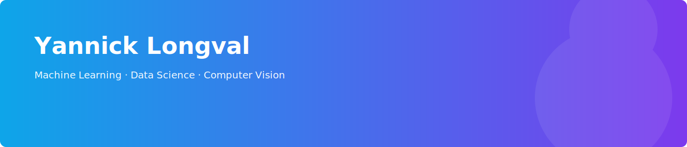

	

	

### Hey! I’m Yannick 👋

I build applied machine-learning and data projects, computer-vision systems, full‑stack web apps, and research/prototype smart-contract code. I study Computer Science at the University of Toronto and focus on reproducible, well-documented prototypes.

- 🔭 Current focus: ML for real-world data, financial research tools, and reproducible prototypes
- 🌱 Learning: advanced deep learning architectures and Solidity development
- 💬 Chat about: ML, trading systems, computer vision, and full‑stack engineering

---

### What I build

- Machine-learning experiments and reproducible notebooks
- Data analysis and finance-focused research code
- Computer-vision prototypes and tooling
- Small full‑stack applications and developer utilities

---

### Tech & tools
Python · PyTorch/TensorFlow · scikit-learn · JavaScript · Node.js · TypeScript · Solidity · SQL · Flask · Vue/React · Git

---

### Contact
- Email: y.longval@mail.utoronto.ca
- LinkedIn: https://www.linkedin.com/in/yannick-longval
- Portfolio: https://yannicklongval.github.io/ylongval/